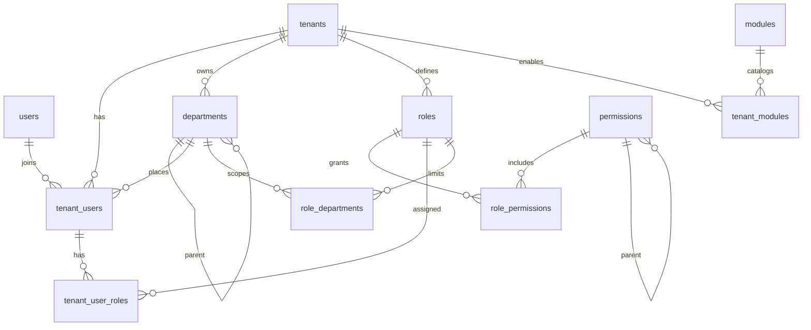

# ER

```mermaid
erDiagram
  users ||--o{ tenant_users : joins
  tenants ||--o{ tenant_users : has
  tenants ||--o{ departments : owns
  departments ||--o{ departments : parent
  departments ||--o{ tenant_users : places
  tenants ||--o{ roles : defines
  tenants ||--o{ tenant_modules : enables
  modules ||--o{ tenant_modules : catalogs
  roles ||--o{ role_permissions : grants
  permissions ||--o{ role_permissions : includes
  permissions ||--o{ permissions : parent
  tenant_users ||--o{ tenant_user_roles : has
  roles ||--o{ tenant_user_roles : assigned
  roles ||--o{ role_departments : limits
  departments ||--o{ role_departments : scopes
```

`users`、`modules`、`permissions` 是全局目录。其余业务表带 `tenant_id`。`personal_access_tokens` 的主体是 `users`，不进入上面的租户关系。
